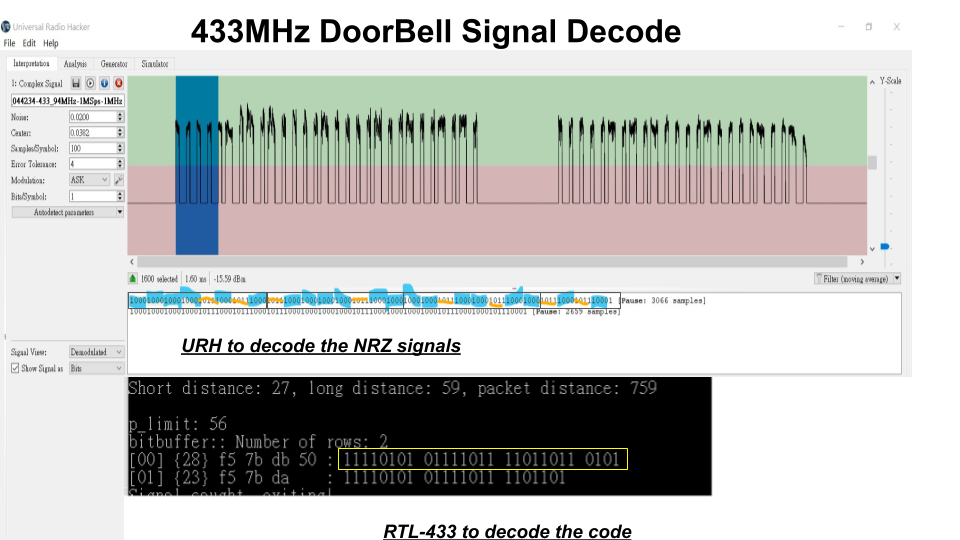

# Tasmota_ESP8285_ESP32  
The Tasmota project forks for ESP8285/ESP32 (TTGO Heltec)

 
A 433MHz Doorbell signal decoding w/ URH & RTL-433 

  

Uploaded an AudioFSK clip [SOS AFSK](https://github.com/jmysu/Tasmota_ESP8285_ESP32/blob/master/pic/SOS433_0820.mp4)
Codes are kept in PlatformIO folder...
  

## References
  - [Arduino Tasmota Library] (https://github.com/arendst/Tasmota) An Arduino library with RF Wifi bridge/gateway.
  - [URH] (https://github.com/jopohl/urh) Universal Radio Hacker tool for _SDR_.
  - [RTL-433] (https://github.com/merbanan/rtl_433) RF decoding utility for _SDR_.
